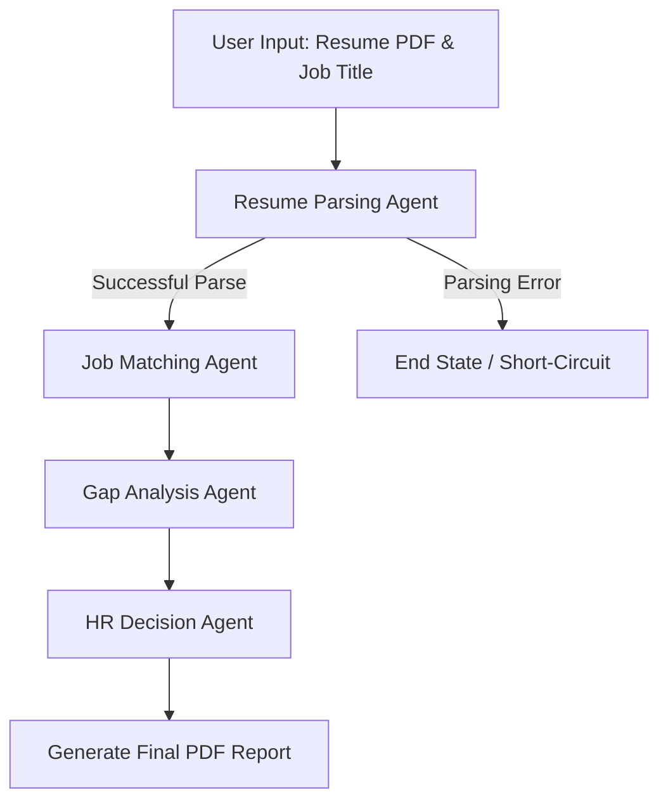

# Technical Report: HR Candidate Screening Support Assistant

## 1. Problem Domain
Human Resource (HR) departments routinely process hundreds of resumes for a single job opening. Manually screening these documents, cross-referencing candidate skills against specific job requirements, identifying critical knowledge gaps, and summarizing findings is a repetitive, inconsistent, and highly time-consuming process. Human recruiters are susceptible to fatigue and implicit bias, which can lead to overlooking qualified candidates or advancing unqualified ones.

Our solution automates this complex workflow using a fully autonomous **Multi-Agent System (MAS)**. By deploying a team of specialized AI agents acting in sequence, the system intakes raw candidate resumes, quantifies their skills against a database of requirements, performs dynamic gap analysis using real-world context, and generates a data-driven final hiring recommendation. This ensures a consistent, unbiased, and significantly faster screening pipeline.

---

## 2. System Architecture
The system is built upon a **Sequential Pipeline Multi-Agent Architecture** orchestrated by **LangGraph**. It operates entirely locally using small language models (`llama3:8b` via Ollama) to guarantee zero cloud costs and total data privacy.

### Agent Roles and Responsibilities
1.  **Resume Parsing Agent:** Acts as the data extractor. Ingests unstructured PDF data and outputs a strictly typed JSON profile.
2.  **Job Matching Agent:** Acts as the quantitative analyst. Calculates the overlap between the extracted profile and database requirements.
3.  **Gap Analysis Agent:** Acts as the technical assessor. Evaluates missing skills and queries the web to determine the severity of the gap.
4.  **HR Decision Agent:** Acts as the final synthesizer. Compiles all matrices into a human-readable recommendation report.

### Workflow Diagram


---

## 3. Agent Design

### Interaction Strategy
The agents do not communicate via conversational chat; instead, they operate using a **delegator-worker pipeline**. Each agent strictly processes the global state, appends its unique findings, and hands the state off to the next agent in the sequence. 

### System Prompts, Constraints & Reasoning Logic
*   **Agent 1 (Resume Parsing):** 
    *   *Persona:* HR Data Extraction Specialist.
    *   *Constraint:* Zero hallucination. Must extract only explicit text into JSON.
    *   *Logic:* Utilizes local SLM pattern matching to map unstructured text to `name`, `skills`, and `experience`.
*   **Agent 2 (Job Matching):** 
    *   *Persona:* Precision-oriented HR Data Analyst.
    *   *Constraint:* Must perform exact semantic matching between candidate skills and the retrieved database list.
    *   *Logic:* Calculates a mathematical match score (0-100%) and categorizes skills into `matched` or `missing`.
*   **Agent 3 (Gap Analysis):** 
    *   *Persona:* HR Technical Assessor.
    *   *Constraint:* Do not invent skills. Analyze only the `missing_skills` array.
    *   *Logic:* Determines if a missing skill constitutes a Low, Medium, or High risk to the hiring decision based on web context.
*   **Agent 4 (Decision Agent):** 
    *   *Persona:* Senior HR Executive.
    *   *Constraint:* Synthesize only. Output must adhere to specific markdown headers (`SUMMARY`, `JUSTIFICATION`, `RECOMMENDATION`).
    *   *Logic:* Compiles all previous JSON matrices into a definitive, factual HR verdict.

---

## 4. Custom Tools and Interactions
Agents rely on four distinct custom Python tools to interact with the real world. All tools utilize strict type hinting and robust error handling.

1.  **`read_resume_pdf(filepath: str) -> str`**
    *   *Interaction:* File system read.
    *   *Usage:* Uses `pypdf` to extract raw text blocks from applicant PDFs.
2.  **`query_skills_db(job_title: str) -> List[str]`**
    *   *Interaction:* Local database query.
    *   *Usage:* Executes a `SELECT` statement on `hr_database.db` to retrieve the mandatory skill constraints for the target role.
3.  **`search_duckduckgo(query: str) -> List[Dict[str, Any]]`**
    *   *Interaction:* Public free API call.
    *   *Usage:* Agent 3 queries DuckDuckGo (e.g., "Importance of Kubernetes for Software Engineer") to contextualize unfamiliar missing skills.
4.  **`generate_pdf_report(state: AgentState) -> str`**
    *   *Interaction:* File system write.
    *   *Usage:* Uses `FPDF` to format the Decision Agent's string output into a professional PDF document.

---

## 5. State Management
The system prevents context dropout by maintaining a single, globally accessible "state" passed sequentially between agents. This is handled using LangGraph's strongly typed `TypedDict` structure.

**Global State Structure (`AgentState`):**
```python
class AgentState(TypedDict):
    input_resume_path: str               # Provided by User
    job_description: str                 # Provided by User
    candidate_profile: Dict[str, Any]    # Populated by Agent 1
    match_result: Dict[str, Any]         # Populated by Agent 2
    gap_analysis: Dict[str, Any]         # Populated by Agent 3
    final_output: str                    # Populated by Agent 4
```
*Context Passing:* As the state moves through the pipeline, each agent reads the data populated by the preceding agents and writes its specific output key, ensuring zero data loss.

---

## 6. Evaluation Methodology
To guarantee accuracy and reliability, the system relies on an automated testing harness using `pytest`.
*   **LLM-as-a-Judge:** Because LLM outputs are non-deterministic, we use a secondary local LLM auditor to evaluate the agents' JSON outputs. The judge is prompted with strict criteria (e.g., "Did the agent hallucinate any skills?") and must return a definitive `PASS` or `FAIL`.
*   **Property-Based Testing:** Ensures mathematical logic (e.g., matching scores) and structural formatting (e.g., presence of specific headers) are correct.
*   **Reliability Analysis:** By parsing JSON via robust Regular Expressions rather than fragile library parsers, the system reliably handles the conversational "fluff" often generated by local SLMs like Llama 3, resulting in highly stable execution.

---

## 7. Project Repository
**GitHub Repository:** `[INSERT GITHUB LINK HERE]`

---

## 8. Individual Contributions
The workload was strictly separated to expose all team members to the full spectrum of Agentic AI development. We utilized a unified testing harness, but each student contributed their specific assertions.

### Student 1 (Resume Parsing)
*   **Agent Developed:** Resume Parsing Agent.
*   **Tool Implemented:** `read_resume_pdf` (PyPDF).
*   **Test Contributed:** LLM-as-a-Judge extraction accuracy check.
*   **Challenges Faced:** Handling PDF encoding errors and preventing the SLM from hallucinating skills based solely on a candidate's previous job titles. Addressed by implementing strict Regex JSON parsing over standard JSON loaders.

### Student 2 (Job Matching)
*   **Agent Developed:** Job Matching Agent.
*   **Tool Implemented:** `query_skills_db` (SQLite).
*   **Test Contributed:** Property-based mathematical assertion on match scores.
*   **Challenges Faced:** Synchronizing the semantic knowledge of the LLM with strict database strings (e.g., matching "ReactJS" to "React"). Overcame this by engineering the prompt to act as a semantic bridge rather than a strict string-matching algorithm.

### Student 3 (Gap Analysis)
*   **Agent Developed:** Gap Analysis Agent.
*   **Tool Implemented:** `search_duckduckgo` (Web Search API).
*   **Test Contributed:** LLM-as-a-Judge validation against Risk Level misclassification.
*   **Challenges Faced:** Mitigating API rate limits from DuckDuckGo. Solved by restricting the tool to request a maximum of 3 search results and catching timeout exceptions gracefully.

### Student 4 (HR Decision)
*   **Agent Developed:** HR Decision Agent.
*   **Tool Implemented:** `generate_pdf_report` (FPDF).
*   **Test Contributed:** Formatting constraint assertion and PDF generation check.
*   **Challenges Faced:** Handling `UnicodeEncodeError` when writing LLM output to a PDF file using standard `latin-1` encoding. Solved by explicitly sanitizing the final string output before passing it to the `multi_cell` method in the FPDF tool.
