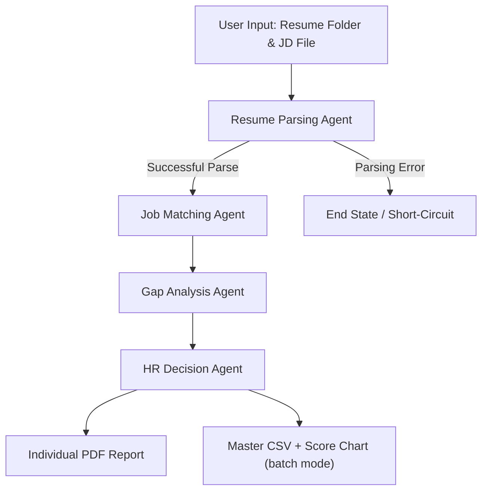

# Technical Report: HR Candidate Screening Support Assistant

## 1. Problem Domain
Human Resource (HR) departments routinely process hundreds of resumes for a single job opening. Manually screening these documents, cross-referencing candidate skills against specific job requirements, identifying critical knowledge gaps, and summarizing findings is a repetitive, inconsistent, and highly time-consuming process. Human recruiters are susceptible to fatigue and implicit bias, which can lead to overlooking qualified candidates or advancing unqualified ones.

Our solution automates this complex workflow using a fully autonomous **Multi-Agent System (MAS)**. By deploying a team of four specialized AI agents acting in sequence, the system intakes raw candidate resumes, semantically compares them to a Job Description file, performs dynamic gap analysis using real-world web context, and generates data-driven hiring recommendations — including a ranked CSV overview and data visualizations for HR decision-makers. This ensures a consistent, unbiased, and significantly faster screening pipeline.

---

## 2. System Architecture
The system is built upon a **Sequential Pipeline Multi-Agent Architecture** orchestrated by **LangGraph**. It operates entirely locally using small language models via Ollama (e.g., `llama3:8b` or `phi3`) to guarantee zero cloud costs and total data privacy.

### Agent Roles and Responsibilities
1.  **Resume Parsing Agent:** Acts as the data extractor. Ingests unstructured PDF data and outputs a strictly typed JSON profile.
2.  **Job Matching Agent:** Acts as the quantitative analyst. Reads the full Job Description file and semantically calculates the overlap between the candidate profile and JD requirements.
3.  **Gap Analysis Agent:** Acts as the technical assessor. Evaluates missing skills and queries the web to determine the severity of the gap.
4.  **HR Decision Agent:** Acts as the final synthesizer. Compiles all matrices into a human-readable recommendation report, plus produces ranked CSV and chart outputs in batch mode.

### Workflow Diagram


---

## 3. Agent Design

### Interaction Strategy
The agents do not communicate via conversational chat; instead, they operate using a **delegator-worker pipeline**. Each agent strictly reads the global `AgentState`, appends its unique findings to a specific key, and hands the mutated state off to the next agent in the sequence.

### System Prompts, Constraints & Reasoning Logic
*   **Agent 1 (Resume Parsing):**
    *   *Persona:* HR Data Extraction Specialist.
    *   *Constraint:* Zero hallucination. Must extract only explicit text into JSON with keys `name`, `skills`, `experience_years`, `role`.
    *   *Logic:* Uses local SLM pattern matching to map unstructured text to structured JSON.
*   **Agent 2 (Job Matching):**
    *   *Persona:* Precision-oriented HR Data Analyst.
    *   *Constraint:* Must perform semantic matching between candidate skills and the full JD text. Must return `match_score` as a strict integer (0-100).
    *   *Logic:* Reads the full Job Description file via `read_job_description` and calculates a nuanced match score, recognizing semantic equivalences (e.g., "ReactJS" ≈ "React").
*   **Agent 3 (Gap Analysis):**
    *   *Persona:* HR Technical Assessor.
    *   *Constraint:* Do not invent skills. Analyze only the `missing_skills` array from the state.
    *   *Logic:* Queries DuckDuckGo to determine whether a missing skill is a Low, Medium, or High risk to the hiring decision.
*   **Agent 4 (Decision Agent):**
    *   *Persona:* Senior HR Executive.
    *   *Constraint:* Synthesize only. Output must adhere to specific headers (`SUMMARY`, `JUSTIFICATION`, `RECOMMENDATION`).
    *   *Logic:* Compiles all previous JSON matrices into a definitive, factual HR verdict and generates reporting outputs.

---

## 4. Custom Tools and Real-World Interactions
Agents rely on five distinct custom Python tools to interact with the real world. All tools utilize strict type hinting, docstrings, and robust error handling.

1.  **`read_resume_pdf(filepath: str) -> str`**
    *   *Interaction:* File system read.
    *   *Usage:* Uses `pypdf` to extract raw text blocks from applicant PDFs. If extraction returns 0 characters (image-based PDF), falls back to `pytesseract` + `pdf2image` OCR.

2.  **`read_job_description(filepath: str) -> str`**
    *   *Interaction:* File system read.
    *   *Usage:* Reads a plain-text or Markdown Job Description file, providing the LLM with rich contextual requirements for semantic comparison rather than rigid keyword matching.

3.  **`search_duckduckgo(query: str) -> List[Dict[str, Any]]`**
    *   *Interaction:* Public free API call (DuckDuckGo).
    *   *Usage:* Agent 3 queries DuckDuckGo (e.g., "Importance of Kubernetes for Software Engineer") to contextualize unfamiliar missing skills. Returns up to 3 results.

4.  **`generate_pdf_report(state: AgentState) -> str`**
    *   *Interaction:* File system write.
    *   *Usage:* Uses `FPDF` to format the Decision Agent's string output into a professional PDF document saved to `local_data/output_reports/`.

5.  **`generate_ranked_csv(candidates: List) -> str` + `generate_score_graphs(candidates: List) -> str`**
    *   *Interaction:* File system write (CSV + PNG).
    *   *Usage:* Uses `pandas` to sort candidates by match score and export a `Master_Ranking_Overview.csv`. Uses `matplotlib` to export a color-coded `Candidate_Scores_Chart.png` for HR visualization.

---

## 5. State Management
The system prevents context dropout by maintaining a single, globally accessible "state" passed sequentially between agents. This is handled using LangGraph's strongly typed `TypedDict` structure.

**Global State Structure (`AgentState`):**
```python
class AgentState(TypedDict):
    input_resume_path: str               # Provided by User
    job_description: str                 # File path to JD text file
    candidate_profile: Dict[str, Any]    # Populated by Agent 1
    match_result: Dict[str, Any]         # Populated by Agent 2 (contains match_score: int)
    gap_analysis: Dict[str, Any]         # Populated by Agent 3
    final_output: str                    # Populated by Agent 4
```
*Context Passing:* As the state moves through the pipeline, each agent reads the data populated by the preceding agents and writes its specific output key, ensuring zero data loss.

**Batch State Structure (`BatchState`):**
```python
class BatchState(TypedDict):
    candidates: List[AgentState]   # Aggregated results from the batch loop
    master_report_path: str
    graph_path: str
```

---

## 6. Evaluation Methodology
To guarantee accuracy and reliability, the system relies on an automated testing harness using `pytest`.
*   **LLM-as-a-Judge:** Because LLM outputs are non-deterministic, we use a secondary local LLM auditor to evaluate each agent's output. The judge is prompted with strict criteria (e.g., "Did the agent hallucinate any skills?") and must return a definitive `PASS` or `FAIL`.
*   **Property-Based Testing:** Ensures mathematical logic (e.g., `match_score` is an integer 0–100) and structural formatting (e.g., presence of specific headers) are correct regardless of the candidate input.
*   **Reliability Analysis:** By parsing JSON via robust Regular Expressions rather than fragile library parsers, the system reliably handles conversational "fluff" often generated by local SLMs.

---

## 7. Project Repository
**GitHub Repository:** `[INSERT GITHUB LINK HERE]`

---

## 8. Individual Contributions

### Sasmitha (Resume Parsing)
*   **Agent Developed:** Resume Parsing Agent.
*   **Tool Implemented:** `read_resume_pdf` (PyPDF + pytesseract OCR fallback).
*   **Test Contributed:** LLM-as-a-Judge extraction accuracy check — verifying no hallucinated skills.
*   **Challenges Faced:** Handling image-based PDFs that return 0 characters from standard parsing. Solved by implementing a `pytesseract` OCR fallback that triggers automatically when the extracted text is empty.

### Isara (Job Matching)
*   **Agent Developed:** Job Matching Agent.
*   **Tool Implemented:** `read_job_description` (plain-text JD file reader).
*   **Test Contributed:** Property-based assertion verifying `match_score` is a valid integer between 0 and 100.
*   **Challenges Faced:** Replacing a rigid SQLite database lookup with flexible, file-based JD parsing. Solved by engineering the agent prompt to perform semantic reasoning against the full JD text rather than a fixed keyword list.

### Olivea (Gap Analysis)
*   **Agent Developed:** Gap Analysis Agent.
*   **Tool Implemented:** `search_duckduckgo` (DuckDuckGo Web Search API).
*   **Test Contributed:** LLM-as-a-Judge validation against Risk Level misclassification.
*   **Challenges Faced:** Mitigating API rate limits from DuckDuckGo during batch runs. Solved by restricting the tool to a maximum of 3 search results and catching empty-result responses gracefully, falling back to inherent LLM knowledge.

### Dinithi (HR Decision)
*   **Agent Developed:** HR Decision Agent.
*   **Tool Implemented:** `generate_pdf_report` (FPDF), `generate_ranked_csv` (pandas), `generate_score_graphs` (matplotlib).
*   **Test Contributed:** Formatting constraint assertion and file creation check for both the PDF report and the CSV.
*   **Challenges Faced:** (1) Handling `UnicodeEncodeError` when writing LLM output to a PDF using `latin-1` encoding — solved by encoding strings with `replace` error handling. (2) Ensuring the bar chart correctly handles edge cases where all candidates return 0% match scores.


## 1. Problem Domain
Human Resource (HR) departments routinely process hundreds of resumes for a single job opening. Manually screening these documents, cross-referencing candidate skills against specific job requirements, identifying critical knowledge gaps, and summarizing findings is a repetitive, inconsistent, and highly time-consuming process. Human recruiters are susceptible to fatigue and implicit bias, which can lead to overlooking qualified candidates or advancing unqualified ones.

Our solution automates this complex workflow using a fully autonomous **Multi-Agent System (MAS)**. By deploying a team of specialized AI agents acting in sequence, the system intakes raw candidate resumes, quantifies their skills against a database of requirements, performs dynamic gap analysis using real-world context, and generates a data-driven final hiring recommendation. This ensures a consistent, unbiased, and significantly faster screening pipeline.

